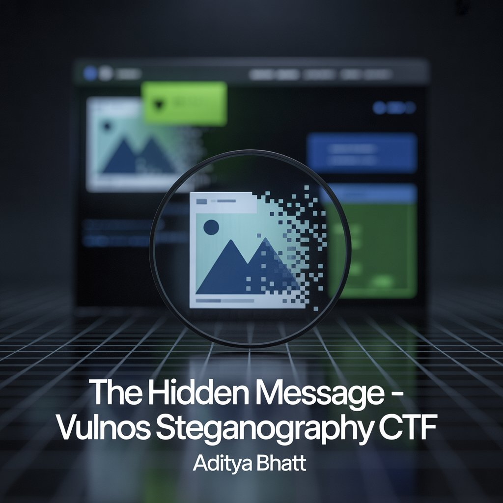
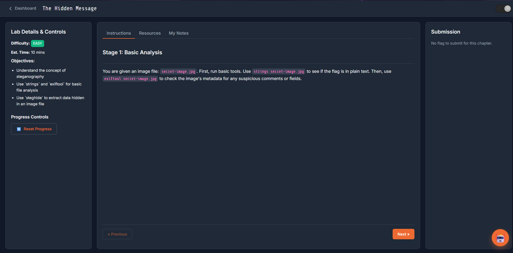
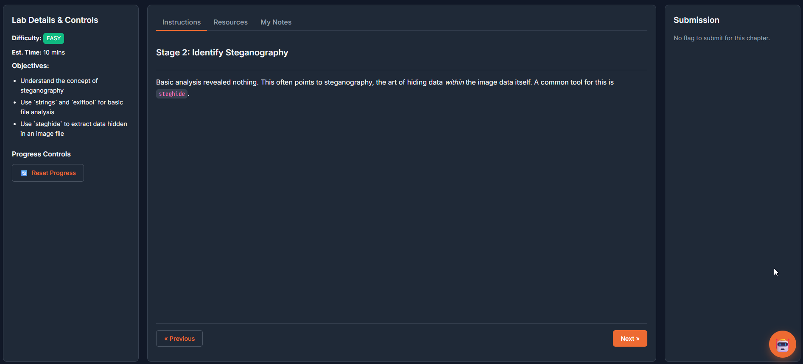
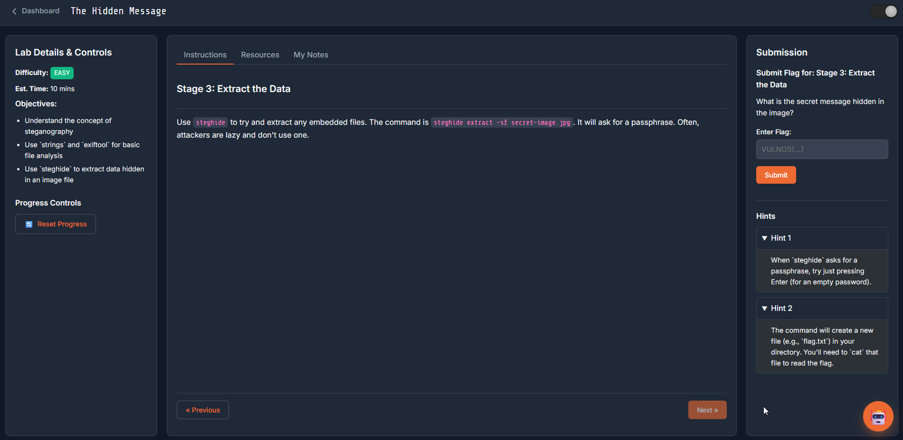
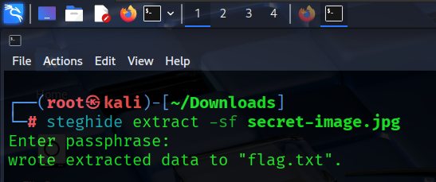
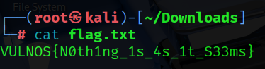

# 🕵️‍♂️ The Hidden Message – VulnOS Steganography CTF

**Platform:** VulnOS <br/>
**Lab Link:** [https://learn.vulnos.tech/lab/environment.html?id=80](https://learn.vulnos.tech/lab/environment.html?id=80) <br/>
**CTF Name:** The Hidden Message <br/>
**Difficulty:** Easy <br/>
**Estimated Time:** ~10 minutes <br/>
**Category:** Steganography / Basic Forensics <br/>

---

## ⚡ TL;DR

* Performed basic file analysis using `strings` and `exiftool`
* No readable strings or metadata clues were found
* Identified likely use of image-based steganography
* Extracted hidden data using `steghide`
* No passphrase was required
* Successfully recovered the flag from `flag.txt`



---

## 📌 Introduction

Steganography is the practice of **concealing information inside seemingly innocent files**, most commonly images, audio, or videos. Unlike cryptography—where data is visibly encrypted—steganography aims to **hide the very existence of the message itself**.

In this CTF, *The Hidden Message*, we are provided with a single image file and tasked with determining whether any secret data is embedded inside it—and if so, extracting it using standard Linux analysis tools.

This technique is frequently encountered in:

* CTF challenges
* Malware payload delivery
* Covert data exfiltration techniques

Understanding this workflow is valuable not only for competitions but also for **real-world forensic and malware analysis**.

---

## 🎯 Objectives

* Understand the concept of image-based steganography
* Perform basic file analysis using `strings` and `exiftool`
* Extract hidden data from an image using `steghide`

---

## 🧪 Proof of Concept (PoC)

The lab provides a single image file named **secret-image.jpg**.
The goal is to determine whether any data is hidden inside the image and, if so, extract it using standard Linux tools.

Each step below is **mapped directly to a screenshot**, stored in the same directory **VulnOS_Steg**, as it would appear in a GitHub repository.

---

## 🧩 Stage 1: Basic Analysis

Before assuming steganography, we always perform **low-effort checks** to see if the flag is exposed directly.

### 🔎 Step 1: Extract Readable Strings

The `strings` command is used to extract human-readable ASCII characters from binary files.
If the flag was embedded carelessly or appended in plain text, it may show up here.

PAYLOAD

```
strings secret-image.jpg
```

🧠 **Why this works:**
Some challenges hide data without proper encoding or compression. `strings` quickly reveals such mistakes.



No readable flag or meaningful strings were found.

---

### 🔎 Step 2: Inspect Image Metadata

Next, we inspect the image metadata using `exiftool`. Metadata fields like comments, descriptions, or software tags are commonly abused to store hidden messages.

PAYLOAD

```
exiftool secret-image.jpg
```

🧠 **Why this matters:**
Metadata-based hiding is trivial and very common in beginner steganography challenges.



No suspicious metadata fields were present.

---

## 🕶️ Stage 2: Identifying Steganography

Since:

* No readable strings were found
* No metadata hints were present

This strongly indicates that the data is hidden **inside the image’s binary/pixel data**, which is classic steganography.

A widely used tool for this purpose is **steghide**.



🧠 **Why steghide:**
It allows files to be embedded directly into images and optionally protected with a passphrase.

---

## 🧨 Stage 3: Extracting the Hidden Data

We now attempt to extract any embedded content from the image.

PAYLOAD

```
steghide extract -sf secret-image.jpg
```

🧠 **Payload explanation:**

* `steghide extract` → attempts to extract hidden data
* `-sf` → specifies the stego file (carrier image)
* `secret-image.jpg` → the image suspected of containing hidden data

### 🔓 Passphrase Prompt

Steghide prompts for a passphrase.
In many beginner labs and real-world cases, **no passphrase is used**.

We simply press **Enter**.



✅ The embedded file **flag.txt** is successfully extracted.

---

## 🏁 Final Step: Reading the Flag

With the hidden file extracted, we read its contents.

PAYLOAD

```
cat flag.txt
```

🎉 **Flag Retrieved**

```
VULNOS{N0th1ng_1s_4s_1t_S33ms}
```



---

## ✅ Conclusion

This lab demonstrates a **straightforward steganography extraction workflow**:

* Perform basic static analysis first
* Escalate only when no visible clues are found
* Use `steghide` to extract embedded files
* Do not assume a passphrase is always required

Even though this lab is simple, the same technique is frequently used in the real world to hide:

* Malware configuration files
* Credentials
* Command-and-control details

Recognizing and extracting such hidden data is a **core forensic skill**.

---

## 👋 Goodbye Note

Thanks for going through this PoC walkthrough 🗿
Small labs like this build the fundamentals that matter in **CTFs, malware analysis, and real-world investigations**.

Until the next challenge —
**Trust nothing, analyze everything.** 🔥

---

## ⭐ Follow Me & Connect

If you enjoyed this write-up or want to stay connected with my work in **cybersecurity, CTFs, VAPT, and forensics**, feel free to connect with me below:

🔗 **GitHub:** [https://github.com/AdityaBhatt3010](https://github.com/AdityaBhatt3010) <br/>
💼 **LinkedIn:** [https://www.linkedin.com/in/adityabhatt3010/](https://www.linkedin.com/in/adityabhatt3010/) <br/>
✍️ **Medium:** [https://medium.com/@adityabhatt3010](https://medium.com/@adityabhatt3010) <br/>
👨‍💻👩‍💻 **GitHub Repository (PoC & Screenshots):** [https://github.com/AdityaBhatt3010/The-Hidden-Message-VulnOS-Steganography-CTF](https://github.com/AdityaBhatt3010/The-Hidden-Message-VulnOS-Steganography-CTF) <br/>

---

